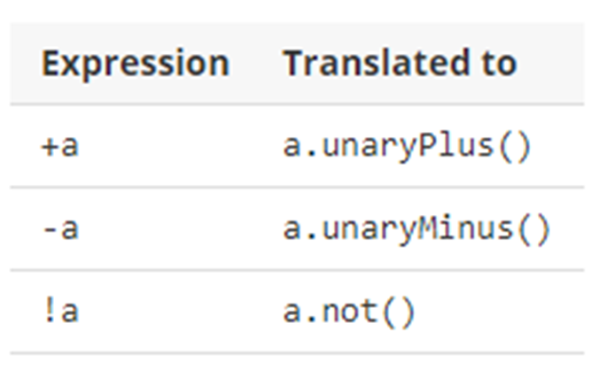
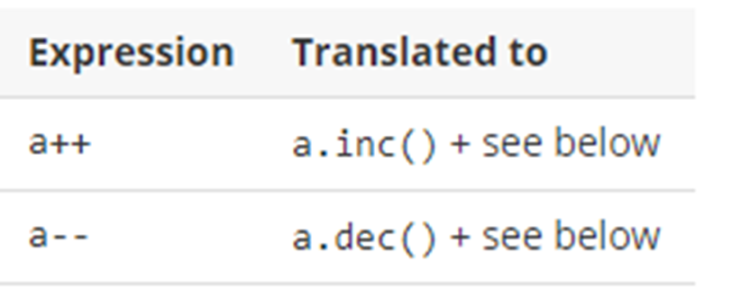
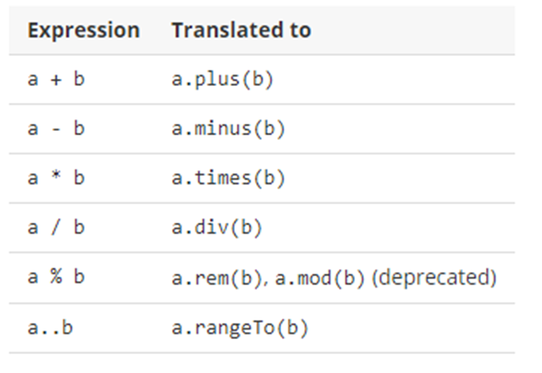
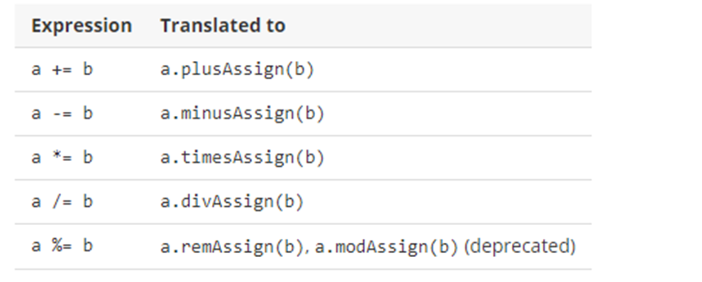
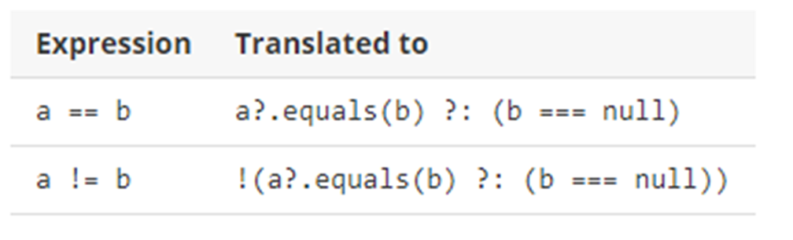
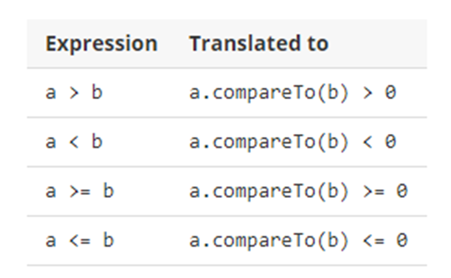

## 기본 문법 정리

### 기본 문법

**주석**
- 자바와 동일

**출력문**
- print, println -> 자바와 다르게 System.out 생략 가능
- 값을 출력할 때는 ${값}을 사용한다.

**세미콜론**
- kotlin은 명령문 마지막의 세미콜론(;)은 선택사항이다.
- 한 줄에 여러 명령문을 작성할 때는 세미콜론(;)을 붙혀줘야 한다.

**리터럴**
- Raw string : ""문자열""
- Nothing : 함수가 정상적으로 끝나지 않는다를 의미
- Unit : void를 의미한다.

**자료형**
- 자바와 다 동일하지만 부호가 없는 정수형이 있다. -> ULong, UInt, UShort, UByte

### 변수와 자료형

- 코틀린은 모든 기본 타입 값을 객체로 만들어 관리한다. 
- 코틀린은 null을 허용하는 변수와 허용하지 않는 변수를 제공한다.

**변수 선언**
- Kotlin은 변수 선언 시 val, var 두 가지 키워드를 사용한다.
- var : 선언 이후 값을 다시 저장할 수 있다.
- val : 선언 이후 값을 다시 저장할 수 없다.
- var/val 변수명:타입 = 값, ex) var/val num:Int = 18
- 타입 생략 시 저장하는 값에 따라 자료형이 자동으로 결정된다.

**null 허용 변수**
- kotlin은 변수를 선언할 때 null 허용 여부를 설정할 수 있다.
- var/val 변수명:자료형 = 값 -> null을 허용하지 않는 변수
- var/val 변수명:자료형? = 값 -> null을 허용하는 변수

### 함수

- 코드를 미리 작성해 놓고 필요할 때 불러 다 쓰는 개념
- java에서는 클래스를 메서드를 만들어 사용하지만 Kotlin은 C언어처럼 함수라는 개념을 제공하고 있다.

**함수 문법**
```kotlin
fun 함수명(매개변수) : 반환값 타입 {
    코드들...
}
```

**기본 함수**
```kotlin
fun main() {
    test1()
}

fun test() {
    println("test1 함수 호출")
}
```

**매개 변수**
- 매개 변수는 "변수명:자료형" 형태로 정의한다.
- 함수 호출 시 전달하는 값에 매개변수를 지정하여 전달 할 수 있다.
```kotlin
fun main(){
        test2(100, 55.55)
        test2(200, 66.66)
        test2(a2 = 77.77, a1 = 300)
}

fun test2(a1:Int. a2:Double) {
    println("test2가 호출되었습니다.")
    println("a1 : &a1")
    println("a2 : &a2")
}
```

**기본 값이 설정된 매개변수**
- 기본 값을 설정할 경우 전달하지 않으면 기본 값이 매개 변수에 설정된다.

```kotlin
fun main() {
    test3(100, 55.55)
    test3(100)
    test3(a2 = 66.66)
}

fun test3(a1:Int = 0 , a2:Double=0.0){
    println("test3이 호출되었습니다.")
    println("a1 : $a1")
    println("a2 : $a2")
}
```

**반환 타입**
- 함수에서 반환할 값이 있다면 return 문을 통해 반환한다.
```kotlin
fun main(){
    val a1 = test4(100, 200)
    val a2 = test4(1000, 2000)
    println("a1 : $a1")
    println("a2 : $a2")
}

fun test4(a1:Int, a2:Int) : Int {
    println("test4가 호출되었습니다")
    return a1 + a2
}
```

**반환 타입이 없는 함수**
- 반환할 값이 없으면 반환 타입을 Unit로 지정한다.
- Unit는 생략이 가능하다.

```kotlin
fun test5(a1:Int, a2:Int) : Unit{
    println("test5가 호출되었습니다.")
}

fun test6(a1:Int, a2:Int) {
    println("test6가 호출되었습니다.")
}
```

**함수의 오버로딩**
- 매개 변수의 형태를 다르게 하여 같은 이름으로 여러 함수를 정의하느 개념
```kotlin
fun test7() {
    println("test7이 호출되었습니다 - 매개변수 없음")
}

fun test(a1:Int) {
    println("test7이 호출되었습니다 - 정수형 매개변수 : $a1")
}

fun test7(a1: Double) {
    println("test7이 호출되었습니다 - 실수형 매개변수 : $a1")
}

fun test7(a1: Int, a2: Int) {
    println("test7이 호출되었습니다 - 매개변수 두 개 : $a1, $a2")
}
```

**지역 함수**
- 함수 내에 정의한 함수
- 함수를 정의한 함수 안에서만 호출이 가능하다.
```kotlin
fun test8() {
    println("test8 함수 호출")

    fun test9(){
        println("test9 함수 호출")
    }
    
    test9()
}
```

**학습 정리**
- kotlin은 함수로만 프로그램 작성이 가능하다.
- fun 함수명(매개변수):반환값 타입 {
    코드들...
  }  
  
### 연산자
- 일부를 제외한 특수 문자를 연산자로 사용한다.
- 주어진 값을 정해진 방식에 따라 계산하고 그 값을 되돌려준다.
- kotlin은 연산자와 함수 두 가지를 제공한다.

**단항 연산자**



**증감 연산자**



**산술 연산자**



**대입 연산자**



**비교 연산자**




출처 :
- [인프런, 윤재성의 Google 공식 언어 kotlin 프로그래밍 시작하기](https://www.inflearn.com/course/%EA%B5%AC%EA%B8%80-%EA%B3%B5%EC%8B%9D-%EC%BD%94%ED%8B%80%EB%A6%B0-%EC%8B%9C%EC%9E%91%ED%95%98%EA%B8%B0/dashboard)